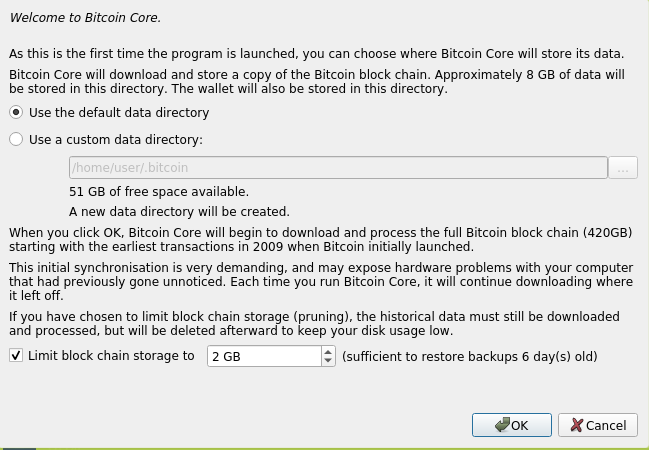

<!--
 ############################################################################
 Project: docker-X11-apps (none)
 File...: dev/bitcoin-core/README.md
 Created: Monday, 2022/03/14 - 10:46:29
 Author.: @fbnmtz, (fabiano.matoz@gmail.com)
 ~·~·~·~·~·~·~·~·~·~·~·~·~~·~·~·~·~·~·~·~·~·~·~·~·~~·~·~·~·~·~~·~·~·~·~·~·~·~
 Last Modified: Monday, 2022/03/14 - 12:54:42
 Modified By..: @fbnmtz, (fabiano.matoz@gmail.com)
 ~·~·~·~·~·~·~·~·~·~·~·~·~~·~·~·~·~·~·~·~·~·~·~·~·~~·~·~·~·~·~~·~·~·~·~·~·~·~
 Version: 0.0.1.7
 ~·~·~·~·~·~·~·~·~·~·~·~·~~·~·~·~·~·~·~·~·~·~·~·~·~~·~·~·~·~·~~·~·~·~·~·~·~·~
 Description: 
  >
 ############################################################################
 HISTORY:
-->
# Biticoin-core



##### Site project:

* [https://bitcoin.org/en/bitcoin-core/](https://bitcoin.org/en/bitcoin-core/)

##### Docker Image:

* [https://hub.docker.com/r/m88v2/bitcoin-core](https://hub.docker.com/r/m88v2/bitcoin-core)

##### Run in Linux:

```bash
docker run --rm -it \
    -v /tmp/.X11-unix:/tmp/.X11-unix \
    -e DISPLAY=$DISPLAY \
    m88v2/bitcoin-core
```

[Go Home](https://github.com/M88V2/docker-X11-apps)
