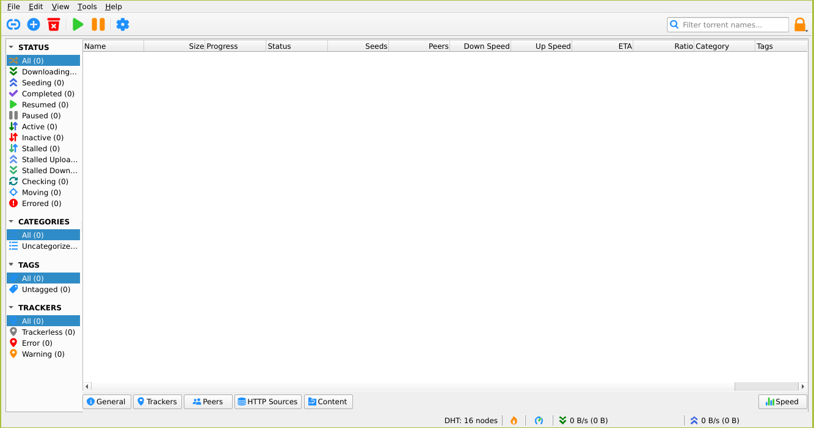

<!--
 ############################################################################
 Project: docker-X11-apps (none)
 File...: qbittorrent/README.md
 Created: Monday, 2022/03/14 - 10:46:29
 Author.: @fbnmtz, (fabiano.matoz@gmail.com)
 ~·~·~·~·~·~·~·~·~·~·~·~·~~·~·~·~·~·~·~·~·~·~·~·~·~~·~·~·~·~·~~·~·~·~·~·~·~·~
 Last Modified: Thursday, 2023/04/27 - 09:01:50
 Modified By..: @fbnmtz, (fabiano.matoz@gmail.com)
 ~·~·~·~·~·~·~·~·~·~·~·~·~~·~·~·~·~·~·~·~·~·~·~·~·~~·~·~·~·~·~~·~·~·~·~·~·~·~
 Version: 0.0.1.8
 ~·~·~·~·~·~·~·~·~·~·~·~·~~·~·~·~·~·~·~·~·~·~·~·~·~~·~·~·~·~·~~·~·~·~·~·~·~·~
 Description: 
  >
 ############################################################################
 HISTORY:
-->

# QBittorrent



##### Site project:

* [https://www.qbittorrent.org//](https://www.qbittorrent.org//)

##### Docker Image:

* [https://hub.docker.com/r/m88v2/qbittorrent/](https://hub.docker.com/r/m88v2/qbittorrent/)

##### Run in Linux:

```bash
docker run --rm -it \
    -v /tmp/.X11-unix:/tmp/.X11-unix \
    -e DISPLAY=$DISPLAY \
    m88v2/qbittorrent:4.5.2
```

[Go Home](https://github.com/M88V2/docker-X11-apps)
