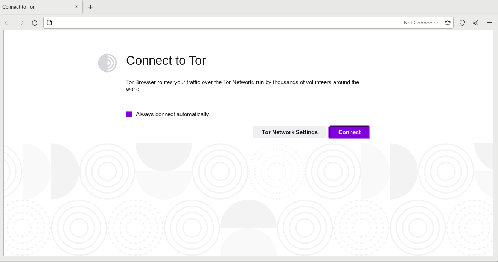

# tor-browser



* Site project:

  * [https://www.torproject.org/](https://www.torproject.org/)

* Docker Image:

  * [https://hub.docker.com/r/m88v2/tor-browser](https://hub.docker.com/r/m88v2/tor-browser)

### Run in Linux:

```bash
docker run --rm -it \
	-v /tmp/.X11-unix:/tmp/.X11-unix \
	-e DISPLAY=$DISPLAY \
	m88v2/tor-browser
```
To share data with application in container set a new volume like this example
```
-v $(pwd):/home/user/share
```

If you not in linux, consider to use this x11 bridge:
* [JAremko/docker-x11-bridge](https://github.com/JAremko/docker-x11-bridge)


[Go Home](../README.md)
